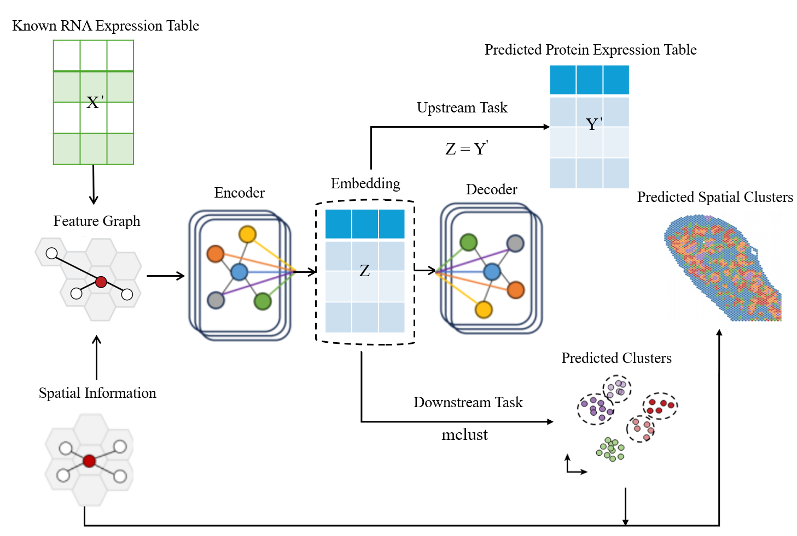

# SPARTA AAAI 2026 Oral | STProtein


## 📣 News

* **[2025/01/26]**:🤗 I will give the **Oral presentation** about STProtein on [**SPARTA AAAI 2026**](https://spartaaaai2026-workshop.github.io/SPARTA_AAAI_workshop_2026/) **Top Conference**
* **[2024/11/18]**:🤗 **[STProtein: predicting spatial protein expression from multi-omics data](https://openreview.net/forum?id=lwerpnT8g3)** is accepted by Spatial Reasoning and Therapeutics with AI : From Omics to Imaging (SPARTA)  AAAI 2026 **Oral**.

## 🌉 Workflow of STProetin




## 💻 SYSTEM REQUIREMENTS

STProtein is tested on single Nvidia RTX 4090. 

## ⏬ INSTALLATION

```bibtex
scanpy
torch
torch-geometric
numpy
pandas
scikit-learn
seaborn
matplotlib
tqdm
```

## 🔒 License
* See [LICENSE](LICENSE) for details.
  
## ✏️ Citation

If you use this software in your research, please cite our paper:

```bibtex
@inproceedings{
jiang2025stprotein,
title={{STP}rotein: predicting spatial protein expression from multi-omics data},
author={Zhaorui Jiang and Yingfang Yuan and Lei Hu and Wei Pang},
booktitle={1st AAAI Workshop on SPARTA {\textemdash} Spatial Reasoning and Therapeutics with AI : From Omics to Imaging},
year={2025},
url={https://openreview.net/forum?id=lwerpnT8g3}
}
```
